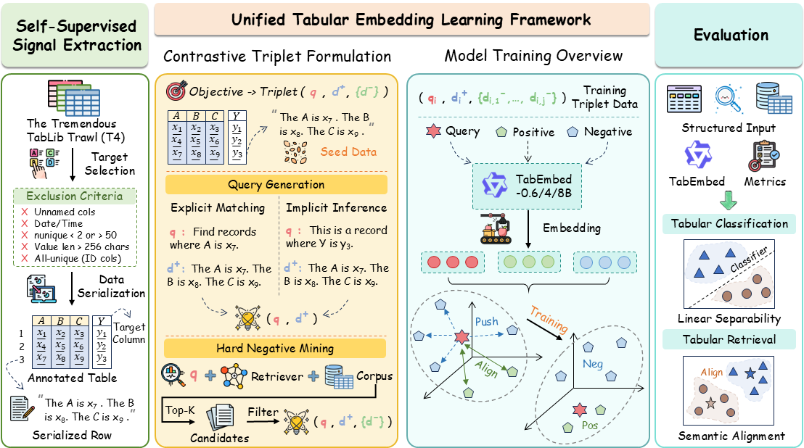
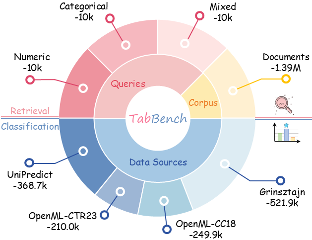

<div align="center">

# TabEmbed

### Benchmarking and Learning Generalist Embeddings for Tabular Understanding

[](LICENSE)
[](https://huggingface.co/datasets/qiangminjie27/TabBench)

</div>

---

## Overview

**TabEmbed** is the first generalist embedding model that unifies tabular classification and retrieval within a shared embedding space. By reformulating diverse tabular tasks as semantic matching problems, TabEmbed leverages large-scale contrastive learning with positive-aware hard negative mining to capture fine-grained structural and numerical semantics.

This repository contains:
- **TabBench**: A comprehensive benchmark for evaluating tabular embedding models (311 classification datasets + 30K retrieval queries)
- **TabEmbed**: Training and evaluation code for the generalist tabular embedding model (0.6B / 4B / 8B)

<p align="center">
  
</p>
<p align="center">
  
</p>

### Key Results

| Model | #Params | Overall | Accuracy | F1 | MRR@10 | nDCG@10 |
|:---|:---:|:---:|:---:|:---:|:---:|:---:|
| Qwen3-Embedding-0.6B | 0.6B | 44.92 | 62.81 | 50.32 | 36.00 | 30.56 |
| **TabEmbed-0.6B** | **0.6B** | **65.27** | **67.16** | **56.56** | **71.72** | **65.64** |
| Qwen3-Embedding-4B | 4B | 48.91 | 65.09 | 52.72 | 42.04 | 35.76 |
| **TabEmbed-4B** | **4B** | **70.71** | **69.51** | **59.75** | **79.33** | **74.25** |
| Qwen3-Embedding-8B | 8B | 48.03 | 65.08 | 52.81 | 40.06 | 34.16 |
| **TabEmbed-8B** | **8B** | **71.62** | **69.88** | **60.19** | **80.58** | **75.83** |

> TabEmbed-0.6B surpasses all baseline models including 7B/8B-scale text embeddings on the overall metric.

## Project Structure

```
TabEmbed/
├── README.md
├── LICENSE
├── requirements.txt
├── .gitignore
├── assets/                        # Figures for README
├── scripts/
│   ├── build_benchmark.sh         # Build TabBench
│   └── run_benchmark.sh           # Evaluate on TabBench
└── src/
    ├── build_benchmark.py         # TabBench benchmark builder
    └── run_benchmark.py           # Benchmark evaluation script
```

> **Note**: Training code (data processing, contrastive learning pipeline) will be released upon paper acceptance.

## Installation

```bash
git clone https://github.com/qiangminjie27/TabEmbed.git
cd TabEmbed
pip install -r requirements.txt
```

## Data Preparation

### Raw Datasets

| Dataset | Description | Link |
|:---|:---|:---|
| **TabBench** | Pre-built evaluation benchmark | [HuggingFace](https://huggingface.co/datasets/qiangminjie27/TabBench) |
| **tabula-8b-eval-suite** | Raw evaluation data (for rebuilding TabBench) | [HuggingFace](https://huggingface.co/datasets/mlfoundations/tabula-8b-eval-suite) |

```bash
# Option 1: Download pre-built TabBench (recommended)
huggingface-cli download qiangminjie27/TabBench --repo-type dataset --local-dir data/TabBench

# Option 2: Build from scratch
huggingface-cli download mlfoundations/tabula-8b-eval-suite --repo-type dataset --local-dir data/tabula-8b-eval-suite

python src/build_benchmark.py \
    -i data/tabula-8b-eval-suite \
    -o data/benchmark \
    --num_workers 64 \
    --classification_max_samples_per_dataset 10000 \
    --classification_train_ratio 0.9 \
    --retrieval_max_samples_per_dataset 10000 \
    --num_queries_per_type 10000
```

## Training

> Training code and data processing pipeline will be released upon paper acceptance. Stay tuned!

## Evaluation

Evaluate any embedding model on TabBench:

```bash
python src/run_benchmark.py \
    --benchmark_dir data/benchmark \
    --model_name_or_path /path/to/model \
    --output_dir results/ \
    --num_gpus 16 \
    --max_seq_length 1024 \
    --batch_size 64 \
    --retrieval_index_type flat
```

### Evaluation Tasks

- **Tabular Classification**: Frozen embeddings + Logistic Regression (per-dataset). Metrics: Accuracy, Macro-F1.
- **Tabular Retrieval**: Dense retrieval with Faiss over a 1.4M-row corpus. Metrics: MRR@10, nDCG@10.

## Models

| Model | Backbone | #Params | HuggingFace |
|:---|:---|:---:|:---|
| TabEmbed-0.6B | Qwen3-Embedding-0.6B | 0.6B | [Coming Soon]() |
| TabEmbed-4B | Qwen3-Embedding-4B | 4B | [Coming Soon]() |
| TabEmbed-8B | Qwen3-Embedding-8B | 8B | [Coming Soon]() |

## Citation

If you use TabEmbed or TabBench in your research, please cite:

```bibtex
@misc{qiang2026tabembedbenchmarkinglearninggeneralist,
      title={TabEmbed: Benchmarking and Learning Generalist Embeddings for Tabular Understanding}, 
      author={Minjie Qiang and Mingming Zhang and Xiaoyi Bao and Xing Fu and Yu Cheng and Weiqiang Wang and Zhongqing Wang and Ningtao Wang},
      year={2026},
      eprint={2605.04962},
      archivePrefix={arXiv},
      primaryClass={cs.CL},
      url={https://arxiv.org/abs/2605.04962}, 
}
```


## Acknowledgements

- [Sentence-Transformers](https://github.com/UKPLab/sentence-transformers) for the training framework
- [Qwen3-Embedding](https://huggingface.co/Qwen) for the backbone models
- [tabula-8b-eval-suite](https://huggingface.co/datasets/mlfoundations/tabula-8b-eval-suite) and [T4](https://huggingface.co/datasets/mlfoundations/t4-full) for the data

## License

This project is licensed under the [Apache 2.0](LICENSE) License.
